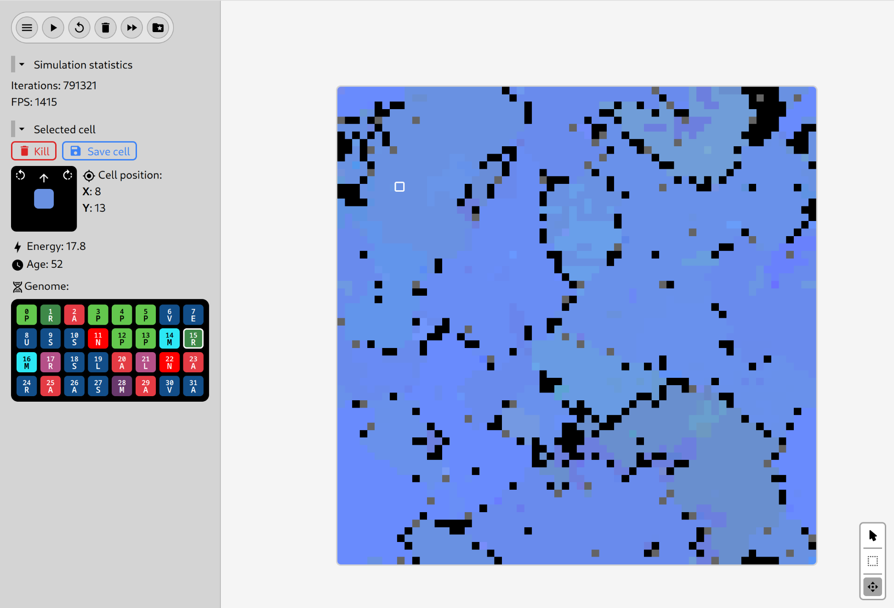

# Cell simulation

This is a cellular automata that simulates the evolution of cells.

Each cell is an independent agent with its own set of commands (genome) that dictates it's
behavior. For examples, there's commands such as "Photosynthesis", "Walk", "Attack". 
After the cell has saved a certain amount of energy, it can make a copy of itself. With a small chance, it's child can have one of it's commands mutated. Now everything is left to natural selection. Cells with unoptimized set of instructions will die quickly, while cells that were lucky, will quickly reproduce and fill the map.

You can inspect each cell, see it's genome, the current instruction, and other parameters such as energy and direction. You can control the cell: kill it, revive it, change it's direction or the current instruction. You can also save the cell for later.

# Technical details

Simulating such behavior, and rendering everything is a CPU-heavy task. With a recent commit, the simulation is being updated and rendered inside a Web Worker. That keeps the main thread free to process inputs, draw the UI and such.
